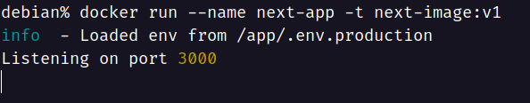

<!-- > **Note**
> Notes can be added here-->

# Containerize a Nextjs Application

> **Warning**
> This is a demo on how you can containerize a nextjs application at its bare basic. I'd recommend the [official guide](https://nextjs.org/docs/deployment) for the production grade deployment.


To containerize a nextjs application, a multi-stage docker will be employed with three stages. Before starting the process we need to make sure that the `next.config.js` file has the following property `output: "standalone"`. It will be explained on stage 2 why would we need this. Let's start by creating the `Dockerfile`.

In stage 1, we'll install all the dependencies that will be required to build and run the application. We start from the  `node:16-alpine` base image and name the stage `deps`. 
```dockerfile
FROM node:16-alpine AS deps
```

Aftward, we install `libc6-compat`. As `alpline` images are usually small they can sometimes lack all the dependencies required for applications to run. To add those missing libraries, it is recommended to add `libc6-compat`. You can read more [here](https://github.com/nodejs/docker-node/tree/b4117f9333da4138b03a546ec926ef50a31506c3#nodealpine).

```dockerfile
RUN apk add --no-cache libc6-compat
```

Now, we change the working directory in the image to `/app`.

```dockerfile
WORKDIR /app
```

Now, we'll copy the package.json and yarn.lock and install all the required node modules.
`--prod` flag will ensure that only the production dependencies are installed. Upon installation, this will mark the end of stage 1.

```dockerfile
COPY ./package.json .
COPY ./yarn.lock .
RUN yarn install --frozen-lockfile --prod
```


We begin the stage 2 `node:16-alpine` base image aging but this time name the stage `builder`. Afterword, we change the working directory in the docker image to `/app`.

```dockerfile
FROM node:16-alpine AS builder
WORKDIR /app
```

Now, we'll copy all dependencies to the image's current working directory (`/app`). `--from=deps` is used to refer to stage 1 (`deps`). Therefore, the copying of `node_modules` will take place from stage 1's `/app` directory to the current images working directory which is also named `/app`. Once dependencies have been copied, the source codes will be copied from the user's local machine's current directory to the docker image's `/app` directory.

```dockerfile
COPY --from=deps /app/node_modules ./node_modules
COPY . .
```
If there is a file containing the environment variable then that needs to be renamed to `.env.production`. For example: 

```dockerfile
COPY .env.production.sample .env.production
```

Once, all the necessary files are copied, `yarn bulid` will be used to generate the production build. With this stage 2 is complete. 

```dockerfile
RUN yarn build
```

We start stage 3, with `node:16-alpine` image again as in previous stages however we no longer require to name the stage. We then change the working directory to `/app` and add the environment variable `NODE_ENV=production`.


```dockerfile
FROM node:16-alpine
WORKDIR /app
ENV NODE_ENV=production
```

Now, we'll copy all the production build assets to current images from stage 2 (`builder`) as follows:

```dockerfile
COPY --from=builder /app/public ./public
COPY --from=builder /app/package.json ./package.json
COPY --from=builder /app/.next/standalone ./
COPY --from=builder /app/.next/static ./.next/static
```

If the default configuration of `next.config.js` is not used then it needs to be copied to the image as follows:

```dockerfile
COPY --from=builder /app/next.config.js ./
```

Now, we can expose the port that will the used by the application and set the port to the environment variable.

```dockerfile
EXPOSE 3000
ENV PORT 3000
```

Finally, we start the server with the following command. 

```dockerfile
CMD ["node", "server.js"]
```


Now it's time for a demo! Let's start by building the image and providing it the name `next-image:v1` where `next-image` is considered the repository name and `v1` the tag name. This will show the following output in the terminal.

```bash
docker build -t next-image:v1 .
```


We can check the image as follows:

```bash
docker images
```


Once the build process is complete, we can now spin up the container by using `docker run` command as follows:

```bash
docker run --name next-app -t next-image:v1
```


Here, `--name` is used to give a name to the container and `-t next-image:v1` is to specify the image out of the container that will be built. After the container starts we can check to `localhost:3000` to see the app. However, doing so would result in the following:


This seems to be counterintuitive as we have already exposed port 3000 in the dockerfile so we should see the app at that port. However, this is not the case because by default any container is inaccessible to the outside world i.e. local machine on which the container is running. Therefore, we need to map the local machine's port to the containers port using `-p` flag as follows:

```bash
docker run --name next-app -p 3000:3000 -t next-image:v1
```


Now, when we go to `localhost:3000` we can see the app. Magic, right?!


Once we're done playing around with the app, we can press `Cltr + C` to stop the application. This however does not delete the container. To delete the container, we need to use `docker rm` command followed by the container name.

```bash
docker rm next-app
```


And finally to delete the image we need to use `docker rmi` followed by the image name as follows:

```bash 
docker rmi next-image:v1
```
 


If you want to quickly checkout the app without going through all the hustle then you can use `docker compose` to do that as follows:

```bash
docker compose up
```

This will use the `docker-compose.yml` in the root directory, create the image and spin up the container all using just a single command. 

THANKS FOR READING. TAKE CARE.